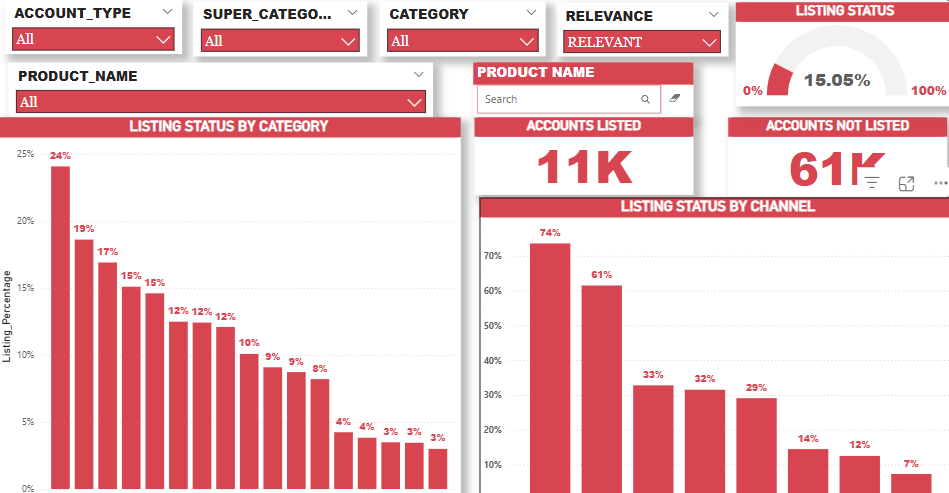

# ETL Data Pipeline Documentation

## Overview
This document outlines the steps for extracting, transforming, and loading (ETL) data into the database, followed by generating visualizations using Power BI.

---

## ETL Pipeline Steps

### 1. **Extract**
- The data is extracted from various sources (e.g., APIs, CSV files, or other databases) using the `src_extract.py` script.
- SQL scripts (e.g., `sql_extract_sales_data.sql`) are used to query and extract relevant data points.

### 2. **Transform**
- Data cleaning, formatting, and validation are performed using the `src_transform.py` script.
- Transformations include:
  - Normalizing data formats.
  - Removing duplicates.
  - Aggregating data for specific metrics.

### 3. **Load**
- The cleaned and transformed data is loaded into the database using the `src_load.py` script.
- Logging is enabled to track the ETL process in `logs_etl_pipeline.log`.

---

## Connecting Power BI to the Database
Once the data has been successfully loaded into the database, Power BI can be used to generate visualizations. The steps to connect Power BI to the database are:
1. Open Power BI Desktop.
2. Click **Get Data** and select the appropriate database type (e.g., SQL Server).
3. Enter the server name and database name.
4. Authenticate using your credentials (username/password or integrated security).
5. Load the required tables or views to the Power BI workspace.

---

## Refreshing Data in Power BI
Since Power BI is connected directly to the database, the visualizations can be updated automatically by refreshing the dataset. After new data is loaded into the database via the ETL pipeline:
1. Open the Power BI report.
2. Click the **Refresh** button in Power BI Desktop or schedule an automatic refresh in the Power BI Service.

---

## Visualizations
The Power BI report provides the following insights:
1. **Listing Status by Category**:
   - Displays the percentage of listings across different product categories.
2. **Accounts Listed vs. Not Listed**:
   - The number of accounts that have listed products versus those that have not.
3. **Listing Status by Channel**:
   - Highlights the distribution of listings across various channels.

### Sample Visualizations
Below is a snapshot of the Power BI visuals generated:

---

## Maintenance and Updates
- **ETL Pipeline**:
  - Update the SQL scripts or transformation logic as required to accommodate changes in the data source or business requirements.
- **Power BI Reports**:
  - Modify the report layout or add new visuals based on stakeholder feedback.

---

## Troubleshooting
1. **Data Not Reflected in Visualizations**:
   - Ensure the ETL pipeline has successfully loaded data into the database.
   - Verify the database connection in Power BI.
2. **Power BI Refresh Errors**:
   - Check database credentials.
   - Verify the availability of the database server.

---

## Conclusion
This documentation provides a comprehensive guide to extracting, transforming, loading, and visualizing data using Power BI. By following the outlined steps, you can ensure the ETL pipeline operates efficiently and delivers actionable insights through dynamic Power BI reports.